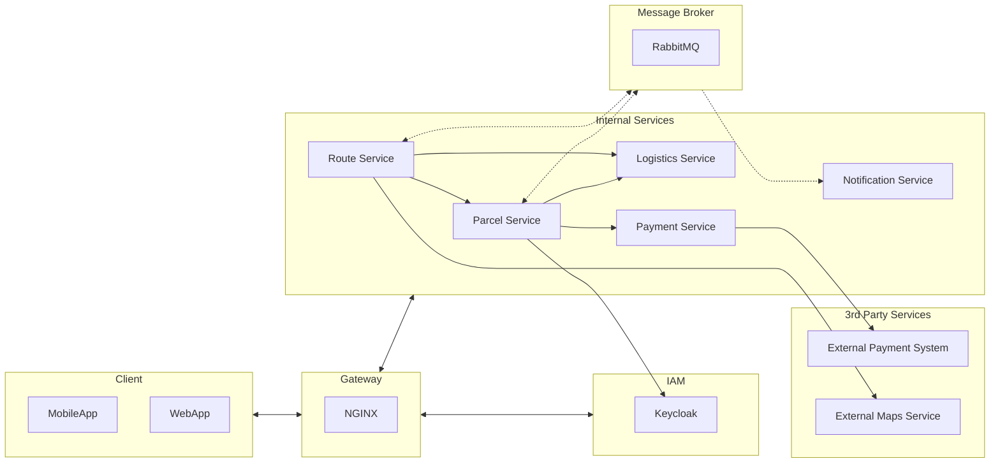

# Parcel Delivery System - Service Architecture

This repository contains the architecture diagram for the Parcel Delivery System, which is divided into various services responsible for different aspects of the application.

## Service Architecture

The architecture of the Parcel Delivery System is divided into the following key components and services:



## Service Responsibilities

### MobileApp / WebApp
Represents the client-side interfaces used by end-users to interact with the system.

### NGINX
Serves as the gateway, handling incoming requests and routing them to the appropriate services.

### Keycloak (IAM)
Manages user authentication and authorization, ensuring secure access to system resources.

### Parcel Service
Manages parcels, including creation, tracking, and pricing.

### Logistics Service
Stores information about vehicles and post offices, which are crucial components of the logistics and operations.

### Route Service
Plans delivery routes for drivers, taking into account various factors like time preferences, vehicle capabilities, and more.

### Payment Service
Manages payment information and transactions associated with user accounts for parcel delivery services.

### Notification Service
Handles the sending of messages and alerts to users, drivers, and support staff regarding changes in parcel status or other relevant information.

### Message Broker (RabbitMQ)
Facilitates asynchronous communication between various services.

### External Payment System / External Maps Service
Represents 3rd party services that the system interacts with for payment processing and mapping functionalities.

Please refer to individual service documentation for more details on their specific responsibilities and functionalities.


## Getting Started

### Prerequisites

Before you begin, make sure you have the following prerequisites installed:

- Docker Engine 19.03.0+

### Starting the Project

1. Copy the `.env.example` file to `.env` and edit the values to configure your project.

2. To start the project, open your terminal and enter the following command:

   ```sh
   make dev
   ```

This command will initiate the development environment.
