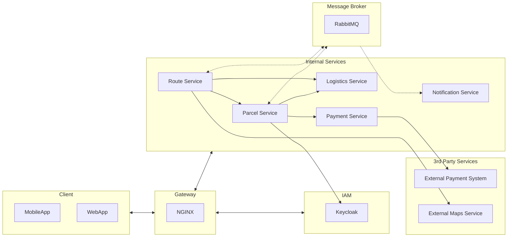

# Parcel Delivery System - Service Architecture

This repository contains the architecture diagram for the Parcel Delivery System, which is divided into various services responsible for different aspects of the application.

## Service Architecture

The architecture of the Parcel Delivery System is divided into the following key components and services:

<!-- TODO: update diagram: forward requests from frontend directly to services instead of passing them through keycloak-->


## Service Responsibilities

### MobileApp / WebApp
Represents the client-side interfaces used by end-users to interact with the system.

### NGINX
Serves as the gateway, handling incoming requests and routing them to the appropriate services.

### Keycloak (IAM)
Manages user authentication and authorization, ensuring secure access to system resources.

### Parcel Service
Manages parcels, including creation, tracking, and pricing.

### Logistics Service
Stores information about vehicles and post offices, which are crucial components of the logistics and operations.

### Route Service
Plans delivery routes for drivers, taking into account various factors like time preferences, vehicle capabilities, and more.

### Payment Service
Manages payment information and transactions associated with user accounts for parcel delivery services.

### Notification Service
Handles the sending of messages and alerts to users, drivers, and support staff regarding changes in parcel status or other relevant information.

### Message Broker (RabbitMQ)
Facilitates asynchronous communication between various services.

### External Payment System / External Maps Service
Represents 3rd party services that the system interacts with for payment processing and mapping functionalities.

Please refer to individual service documentation for more details on their specific responsibilities and functionalities.


## Getting Started

### Prerequisites

Before you begin, make sure you have the following prerequisites installed:

- Docker Engine 19.03.0+
- [Minikube](https://minikube.sigs.k8s.io/docs/start/)
- [Skaffold](https://skaffold.dev/docs/install/)

### Starting the Project in the Local Cluster

1. Launch a local Kubernetes cluster with one of the following tools:

    - To launch **Minikube**. Please, ensure that the
       local Kubernetes cluster has at least:
        - 4 CPUs
        - 4.0 GiB memory
        - 32 GB disk space

      ```shell
      minikube start --cpus=4 --memory 4096 --disk-size 32g
      ```

    - To launch **Docker for Desktop**. Go to Preferences:
        - choose “Enable Kubernetes”,
        - set CPUs to at least 3, and Memory to at least 6.0 GiB
        - on the "Disk" tab, set at least 32 GB disk space


2. Run `kubectl get nodes` to verify you're connected to the respective control plane.

3. Run `skaffold run` (first time will be slow).
   This will build and deploy the application. If you need to rebuild the images
   automatically as you refactor the code, run `skaffold dev` command.

4. Run `kubectl get pods` to verify the Pods are ready and running.

5. Run `kubectl port-forward service/your-service-name 8080(port-on-yout-machine):8080(port-on-k8s-cluster)` to forward a port to the chosen service.

6. Navigate to `localhost:port-on-yout-machine` to access the chosen service.
